 
## 查看主页获取源码

### 一、作品包含

源码+数据库+设计文档万字+PPT+全套环境和工具资源+部署教程

### 二、项目技术

前端技术：Html、Css、Js、Vue、Element-ui

数据库：MySQL

后端技术：Java、Spring Boot、MyBatis

  

### 三、运行环境

开发工具：IDEA/eclipse

数据库：MySQL5.7

数据库管理工具：Navicat10以上版本

环境配置软件： JDK1.8+Maven3.6.3

前端Nodejs：14

### 四、项目介绍
项目编号：springbootA338

中医学习服务管理系统为用户提供了一个集学习资源、在线课程、互动交流于一体的专业平台，以促进中医药知识的传播和技能提升。

这个系统包括管理员、用户两个主要角色。管理员负责系统首页、个人中心、用户管理、中医药知识管理、课程信息管理、课程购买管理、论坛管理和管理员管理等功能的维护和管理；而用户则可以使用系统首页、个人中心、课程购买管理和我的收藏管理等功能。

### 五、运行截图

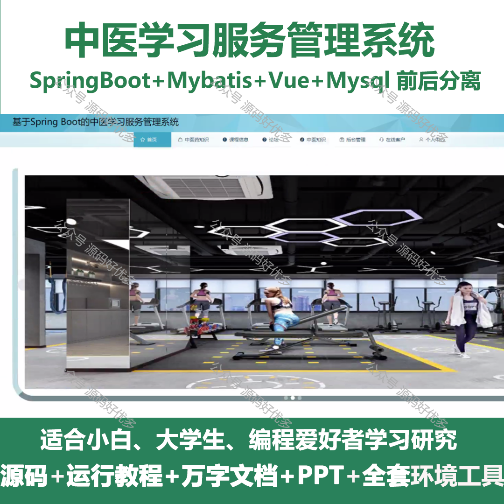
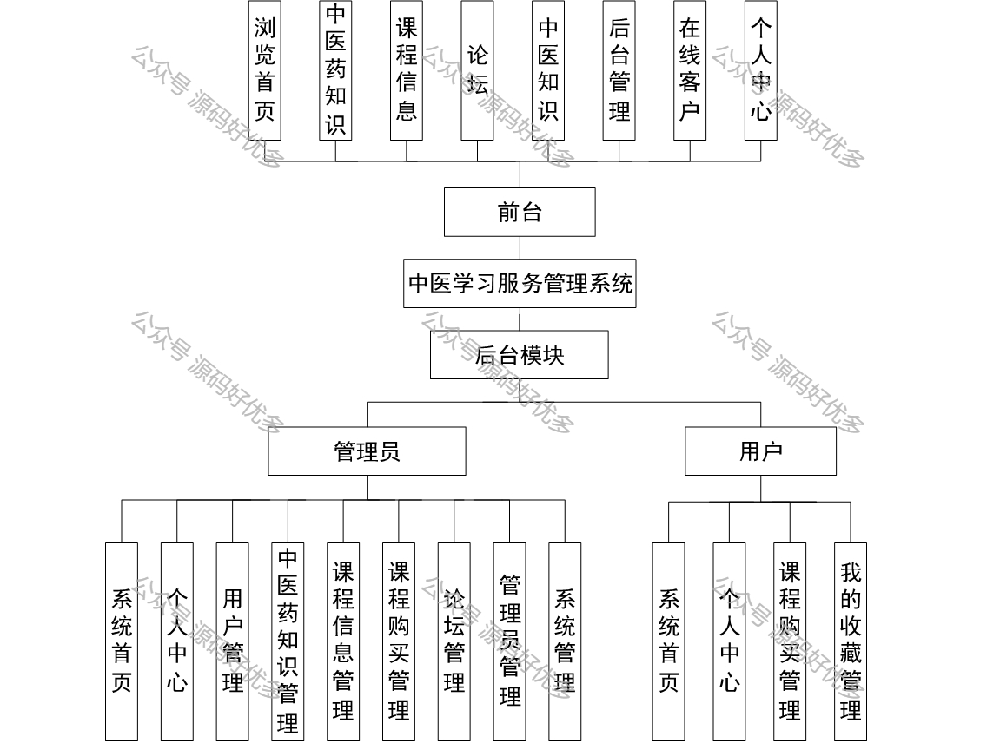

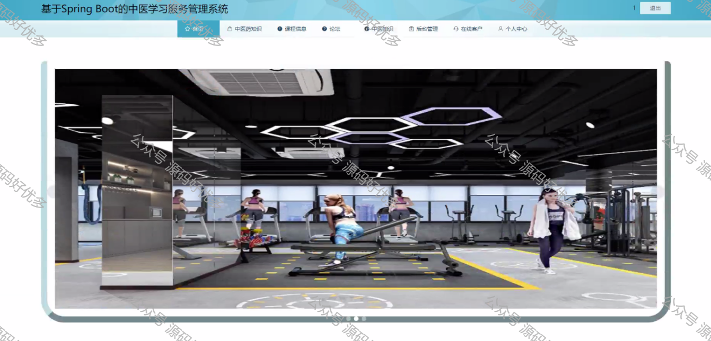
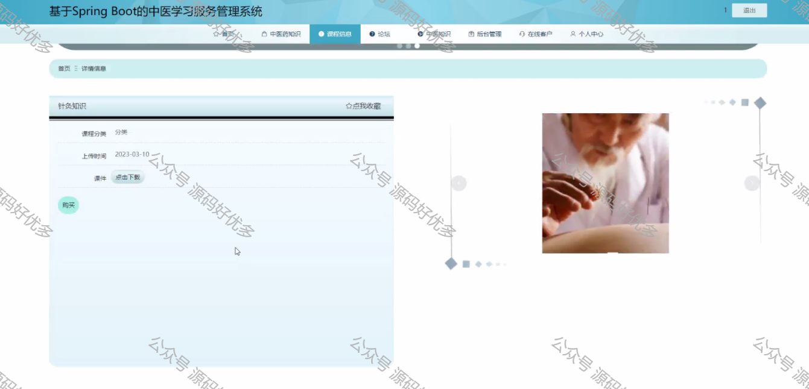
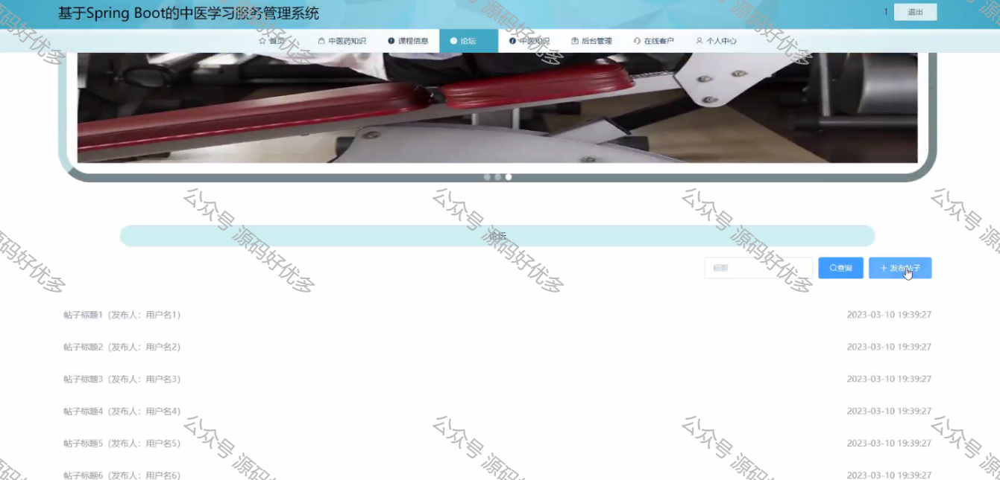
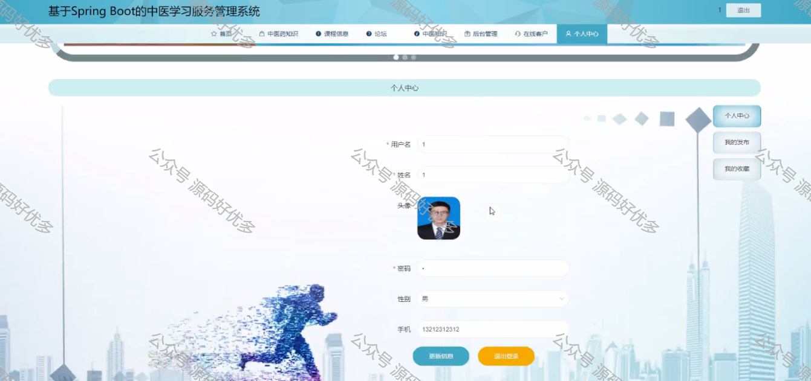
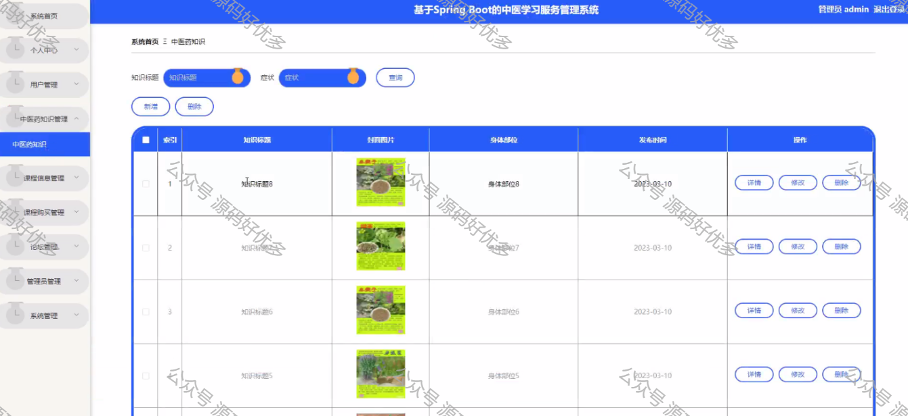
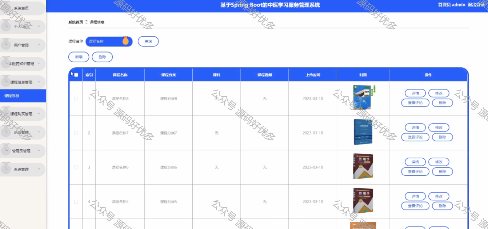
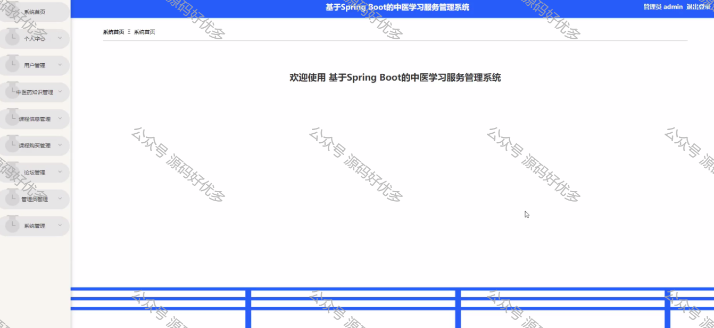
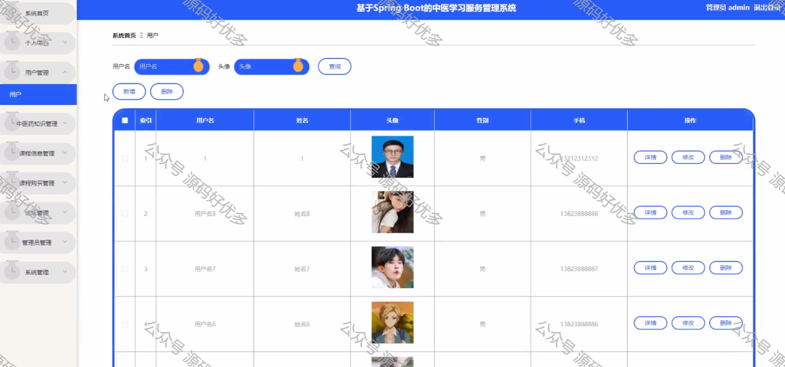
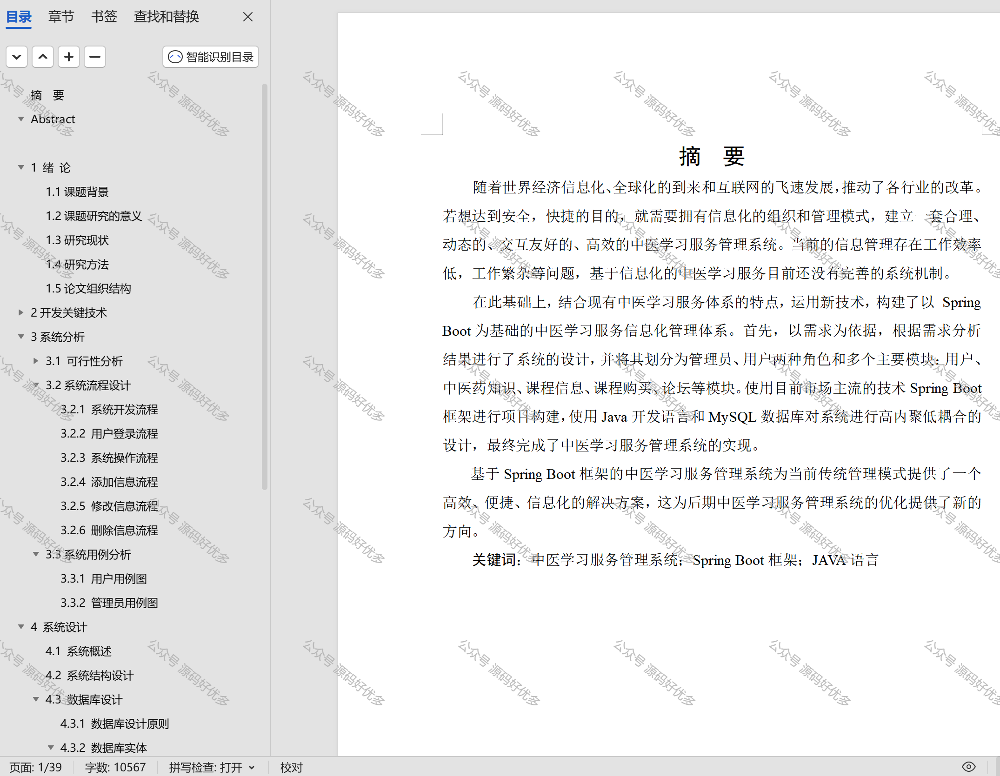

  
